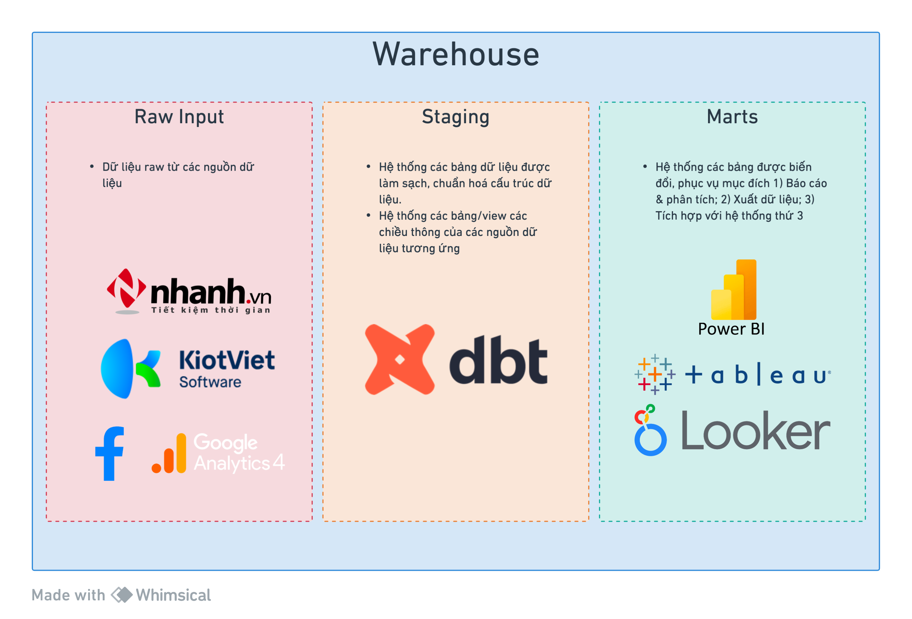

# Sado - analytics project

- Link to [Github](<https://github.com/chienazazaz/sado_analytics_services>)
- Link to [Report](<https://headscloud.dev>)



## Conventions
- snakecase
- staging models: **[staging|base]_[source]__[entity]**
- marts/core models: **[entity]** or **[dim|fct]__[entity]**

## Schedule
- on_push: select all modified models
- every 2 hour (GMT+7): select all incremental and table models (exclude view) 

# Project structure
``` yml
└── sado_analytics_service/
    ├── analyses/
    ├── snapshots/
    └── models/
        ├── staging/
        │   ├── stg_models.sql
        │   ├── stg_models.yml
        │   └── base/
        ├── intermediate
        ├── marts/
        │   ├── marketing/
        │   │   ├── facebook: facebook ads/pages analytics models
        │   │   ├── google: google ads analytics models
        │   │   ├── analytics: website analytics models
        │   │   └── contact_center: contact center centric models
        │   ├── sales: offline sales models
        │   └── online_sales: online sales models
        ├── core: model exposed to dashboard only
        └── utilities: misc and reusable models (calendar, weather, geocoding)
```
